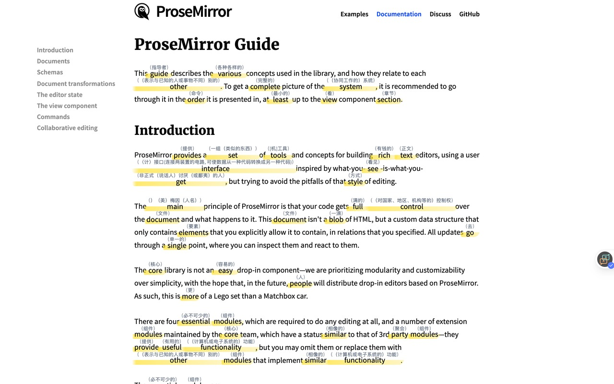
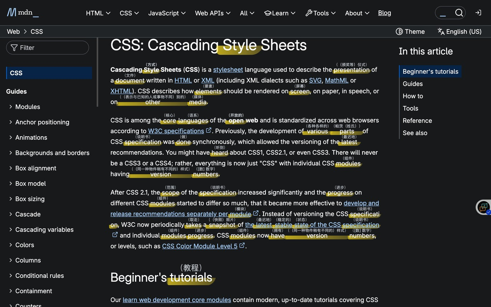
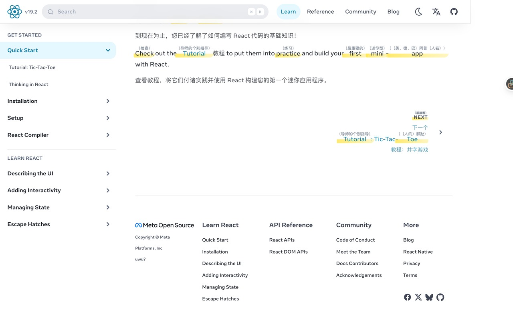

# Xen

English | [简体中文](./README.zh-CN.md)

> A Chrome extension that helps you read English on the original webpage with inline vocabulary, pronunciation, and paragraph translations.

[Website](https://www.xen2.tech/) · [Chrome Web Store](https://chromewebstore.google.com/detail/xen/dlckfhnjphdgdpgenljcbdocpenadfcf?hl=zh) · [Privacy](https://www.xen2.tech/privacy)

## What Xen does

- Reads English directly on the original webpage instead of sending you to a separate reader.
- Adds inline vocabulary hints so unfamiliar words stop breaking reading flow.
- Supports click-to-play pronunciation while you read.
- Shows paragraph-level translations when you need full context.

## Examples

| ProseMirror docs | MDN CSS docs | React docs |
| --- | --- | --- |
|  |  |  |

## Monorepo

- `apps/extension`: browser extension built with WXT.
- `apps/web`: marketing site and privacy pages built with Next.js.
- `packages`: shared workspace packages.

## Development

```bash
pnpm install
pnpm dev:extension
```

For the website:

```bash
pnpm dev:web
```

Extension-specific setup lives in [`apps/extension/README.md`](apps/extension/README.md).
