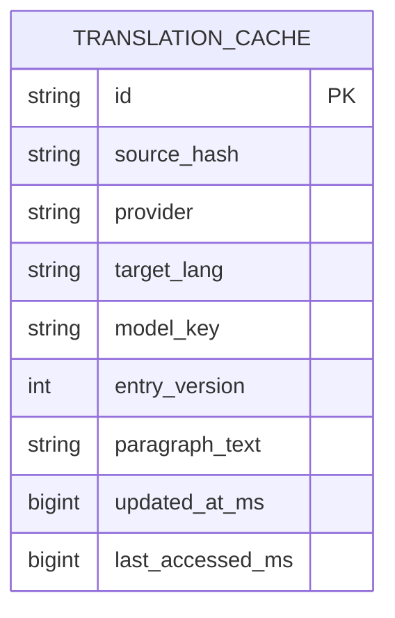

# Pickup 后端数据库设计（最终极简版：仅翻译缓存）

> 目标：前期只做“降低三方翻译调用成本”，其余都不进后端。

## 1. 最小结论

后端只保留 1 张表：

1. `translation_cache`（必须）

不做后端 `annotation_cache`。标注缓存继续只放本地 IndexedDB（`xenPickupCache.annotations`）。

## 2. 当前流程（最终极简）

```mermaid
flowchart LR
  A[PickupTranslateParagraphInput.sourceText] --> B[hash(sourceText)]
  B --> C{translation_cache 命中?}
  C -- 是 --> D[直接返回 paragraphText]
  C -- 否 --> E[调用三方翻译]
  E --> F[写入 translation_cache]
  F --> D

  G[annotation tokens] --> H[仅本地 xenPickupCache.annotations]
```

## 3. ER 图（后端仅 1 表）



## 4. 与当前实现的对应关系

- 后端：`translation_cache`
- 本地 IndexedDB：
  - `xenPickupTranslationCache.translations`（可逐步迁移到后端）
  - `xenPickupCache.annotations`（保留本地，不上后端）

## 5. 前端字段映射（仅翻译缓存）

| 前端来源 | 字段 | 后端字段 |
|---|---|---|
| `PickupTranslateParagraphInput` | `sourceText` | 先算 `source_hash` |
| provider/model | `provider + modelKey` | `provider + model_key` |
| 翻译结果 | `paragraphText` | `paragraph_text` |
| 缓存元数据 | `version/updatedAt/lastAccessed` | `entry_version/updated_at_ms/last_accessed_ms` |

## 6. 必须索引

1. `translation_cache(source_hash, provider, target_lang, model_key, entry_version)` 唯一。
2. `translation_cache(updated_at_ms)` 索引（用于 TTL 清理）。

## 7. 为什么这版最符合你现在需求

1. 只解决“翻译调用成本”这个核心问题。
2. 没有任何业务实体表（`source/segment`），后端实现量最低。
3. annotation 完全沿用当前本地策略，不改你现有主流程。
