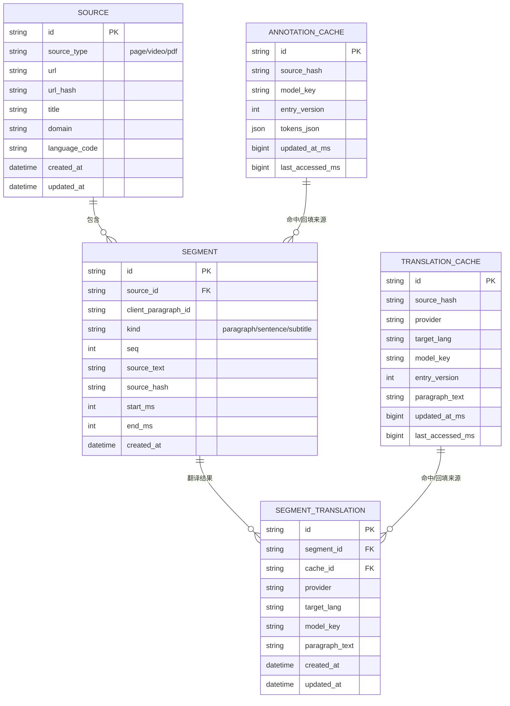

# Pickup 后端数据库设计（MVP 极简版，去掉推荐/可选）

> 目标：前期只保留必须表，优先降低复杂度与上线成本。

## 1. 结论

可以删。

前期只保留 5 张必须表：

1. `source`
2. `segment`
3. `annotation_cache`
4. `translation_cache`
5. `segment_translation`

其余推荐/可选表（例如 `segment_token`、`unit_translation`、设置表、词典表）全部先不落库。

## 2. 当前前端真实流程（MVP 对齐）

```mermaid
flowchart LR
  A[页面 URL + DOM] --> B[collectParagraphs: PickupParagraph{id,text,hash}]
  B --> C[annotate 请求]
  C --> D[PickupAnnotation{tokens[]}]
  D --> E[页面渲染]

  E --> F[translatePreview 请求]
  F --> G[PickupTranslateParagraphPreview{paragraphText,units[]}]
  G --> H[渲染翻译]

  B -.sourceHash.-> I[(annotation_cache)]
  F -.sourceHash + provider/model.-> J[(translation_cache)]
```

## 3. MVP ER 图（仅必须表）



## 4. 与前端字段一一对应（仅 MVP）

| 前端来源 | 字段 | 后端落点 | 备注 |
|---|---|---|---|
| `PickupParagraph` | `text` | `segment.source_text` | 段落原文 |
| `PickupParagraph` | `hash` | `segment.source_hash` | 对应缓存 key 的 `sourceHash` |
| `PickupParagraph` | `id` | `segment.client_paragraph_id` | 前端临时 ID，仅追踪请求 |
| `PickupAnnotation` | `tokens[]` | `annotation_cache.tokens_json` | 先 JSON 存，后续再拆 token 表 |
| `PickupTranslateParagraphPreview` | `paragraphText` | `translation_cache.paragraph_text` + `segment_translation.paragraph_text` | 缓存 + 业务结果 |
| translate provider/model | `google/llm + model` | `translation_cache.provider/model_key` | 与当前缓存策略一致 |

## 5. 明确不入库（第一阶段）

1. `units[]` 词级覆盖（`vocabInfusionText/usphone/ukphone`）先不持久化。
2. 设置项（`xenPickupSettings`、`xenTranslateProvider` 等）先继续走本地 storage。
3. 词典目录与词典选择先不入后端。

## 6. 必须索引（最小集合）

1. `source(url_hash)` 唯一。
2. `segment(source_id, seq)` 唯一。
3. `segment(source_hash)` 索引。
4. `annotation_cache(source_hash, model_key, entry_version)` 唯一。
5. `translation_cache(source_hash, provider, target_lang, model_key, entry_version)` 唯一。
6. `segment_translation(segment_id, provider, target_lang, model_key)` 唯一。

## 7. 为什么这套最省事

1. 保留了你最关心的“翻译缓存降成本”闭环。
2. 保留了 `source`，不会丢页面上下文。
3. 没有 token 明细表、unit 明细表、设置表，后端实现量最小。
4. 后续要扩展时可平滑加表，不会推翻现有 5 表。

## 8. 对应代码位置（便于后端联调）

- 段落采集：`apps/extension/lib/pickup/content/collector.ts`
- 标注缓存：`apps/extension/lib/pickup/background/pickup-background.ts`（`annotateParagraphs`）
- 翻译缓存：`apps/extension/lib/pickup/background/pickup-background.ts`（`buildTranslationPreviews`）
- 协议契约：`packages/contracts/src/pickup.ts`
