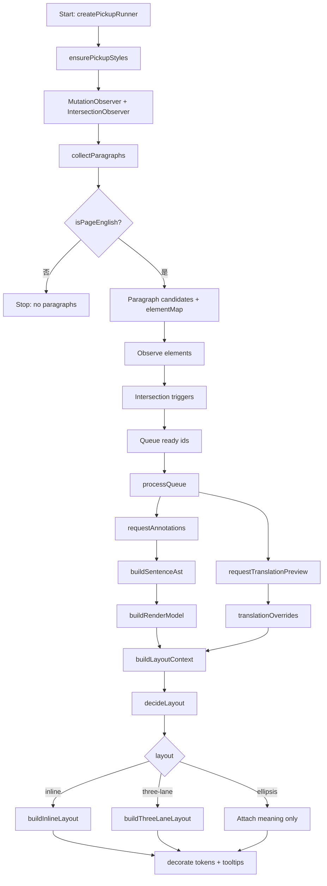

# Pickup 整体架构与流程（细化版）

本文描述从 DOM 采集到渲染落地的全流程架构，包含每个阶段的产物、关键副作用、协同方式与失败路径。适用于排查“段落未被处理 / 布局不符合预期”等问题。

## 1. 总体架构分层

- **采集层**：扫描 DOM，筛选可翻译段落，生成段落任务。核心文件：`lib/pickup/content/collector.ts`、`lib/pickup/content/dom.ts`。
- **调度层**：按视口触发任务请求，控制并发与失败回滚。核心文件：`lib/pickup/content/runner.ts`。
- **通信层**：与后台/服务交互获取标注与翻译。核心文件：`lib/pickup/content/transport.ts`。
- **解析层**：把标注 token → SentenceAst → RenderModel。核心文件：`lib/pickup/ast/*`、`lib/pickup/render-model.ts`。
- **布局层**：根据样式与内容特征决策 inline/three-lane/ellipsis。核心文件：`lib/pickup/content/layout-rules/*`。
- **渲染层**：DOM 替换、注入 token、挂载交互。核心文件：`lib/pickup/content/render.ts`、`lib/pickup/content/interactions.ts`。
- **样式层**：注入默认 UI/交互样式。核心文件：`lib/pickup/content/styles.ts`。

## 2. 端到端流程（详细）

## 3. 每个阶段的产物与副作用

### 3.1 采集层（Collector）

- **输入**：DOM root（通常是 `document`）。
- **产物**：
  - `PickupParagraph[]`：包含 `id`, `text`, `hash`。
  - `elementMap: Map<id, Element>`。
- **副作用**：
  - 在元素上设置 `data-pickup-id`、`data-pickup-status=pending`。
  - 若长度允许，设置 `data-pickup-original` 保存原文。
- **核心过滤策略**：
  - 全局语言门槛：`isPageEnglish()` 为 false 则直接不采集任何段落。
  - 元素可见性与可读性：`isWalkableElement` 排除隐藏/不可见/可编辑等节点。
  - 跳过标签集：如 `IMG`, `BUTTON`, `CODE`, `PRE`, `NAV` 等。

### 3.2 调度层（Runner）

- **输入**：采集到的 `PickupParagraph[]`。
- **产物**：
  - `pending: Map<id, paragraph+element>`。
  - `readyQueue: Set<id>`。
- **副作用**：
  - 对元素注册 `IntersectionObserver`。
  - 当进入视口时设置 `data-pickup-status=loading`。
- **协同机制**：
  - `isApplying` 阻止并发多次渲染。
  - `lastRequestId` 丢弃过期结果。
  - `REQUEST_TIMEOUT_MS` 超时后设置 `data-pickup-status=error`。

### 3.3 通信层（Transport）

- **输入**：段落文本列表。
- **产物**：
  - `PickupAnnotation[]`：标注 tokens。
  - `PickupTranslateParagraphPreview[]`：翻译预览。
- **副作用**：
  - 无（仅返回结果）。
- **协同机制**：
  - 通过消息通道 `sendMessage` 与后台交互。

### 3.4 解析层（AST / RenderModel）

- **输入**：`PickupAnnotation` + 原文。
- **产物**：
  - `SentenceAst`：`units`, `relations`, `grammarPoints`。
  - `RenderModel`：`RenderToken[]`（按原文 offset 排序）。
- **副作用**：
  - 无。
- **协同机制**：
  - 通过 `tokenIndex` / `start-end` 维持 token 与原文的映射。

### 3.5 布局层（Layout Rules）

- **输入**：
  - DOM 元素样式（`computedStyle`）。
  - 文本指标（`wordCount`, `height`, `lineHeight`, `isEllipsis`）。
- **产物**：
  - `LayoutDecision`：`layout`, `priority`, `reason`, `ruleId`。
- **副作用**：
  - 无。
- **协同机制**：
  - 规则按优先级竞争，最高优先级胜出。
  - `ellipsis` 决策会跳过 inline/three-lane 渲染，仅挂 meaning。

### 3.6 渲染层（Render + Interactions）

- **输入**：`RenderModel` + `LayoutDecision` + 翻译覆盖。
- **产物**：
  - DOM 结构：`xen-pickup-three-lane` 或 `xen-pickup-inline`。
  - Token 节点与徽章节点。
- **副作用**：
  - 清空原元素内容并替换为渲染容器。
  - 设置 `data-pickup-processed`, `data-pickup-status=done`, `data-pickup-annotated`。
  - 为 token 节点写入 `data-pickup-meaning` 等属性。
  - 注册 tooltip 交互事件。

### 3.7 样式层（Styles）

- **输入**：无。
- **产物**：
  - 注入 `style` 标签（`xen-pickup-style`）。
- **副作用**：
  - 提供三栏布局、inline 布局、tooltip、loading/error 状态样式。

## 4. 失败路径与副作用隔离

- **页面语言判定失败**：不采集任何段落，`data-pickup-id` 不会出现。
- **标注请求失败**：`data-pickup-status=error`，元素保留原文。
- **超时**：同上，状态设为 `error`。
- **扩展上下文失效**：触发 stop，停止后续采集。
- **渲染失败**：应落到 `error` 并保留原文。

## 5. 协调与协同方式（模块间契约）

- **数据契约**：
  - Collector 负责保证 `text` 是纯文本并且可翻译。
  - AST 负责 token 与原文位置对齐（`start-end` / `tokenIndex`）。
  - Layout 只读 `computedStyle` 与文本指标，不直接改 DOM。
  - Render 只接收“决策结果”，不改变规则。

- **状态契约（data-*）**：
  - `data-pickup-id`：元素已被采集。
  - `data-pickup-status`：`pending/loading/done/error`。
  - `data-pickup-processed` / `data-pickup-annotated`：已渲染完成。
  - `data-pickup-layout`：布局结果（`inline/three-lane/ellipsis`）。

- **并发契约**：
  - `isApplying` 确保一次只渲染一批。
  - `lastRequestId` 丢弃陈旧请求结果。
  - `IntersectionObserver` 控制成本，防止一次性渲染整页。

## 6. 常见问题定位入口

- **没有进入规则判断**：
  - 没有 `data-pickup-id`，说明采集阶段未命中。
  - 有 `data-pickup-id` 但 `status=error`，说明请求失败。
  - `status=done` 但布局不符合预期，查看 `data-pickup-layout`。

- **Case 4 段落不生效**：
  - 页面整体被判为非英文。
  - 元素不可见（`getClientRects` 为空）。
  - 在规则中被 `incomplete-sentence` / `short-words` 优先命中。

## 7. 浏览器调试与输出产物

### 7.1 浏览器调试（Chrome）

- **内容脚本（content script）**：
  - 在目标页面打开 DevTools → `Sources` → `Content scripts`，可直接命中内容脚本。
  - 也可以在 Console 里用 `debugger;` 或 `console.log` 断点追踪（例如在 `applyAnnotations` 前后插入）。

- **Service Worker（后台脚本）**：
  - 进入 `chrome://extensions` → 打开开发者模式 → 找到扩展 → `Service worker` → `Inspect`。

- **Popup / Offscreen 页面**：
  - 在 `chrome://extensions` 里对应条目下点击 `Inspect views` 进入调试器。

### 7.2 WXT 开发构建与输出目录

- **开发模式产物**：
  - `pnpm dev` 会生成 **开发构建**，默认落到 `.output/chrome-mv3-dev/`。
  - 该目录用于本地加载调试（内容脚本/资源都从这里读取）。

- **正式构建产物**：
  - `pnpm build` 会生成 **正式构建**，默认落到 `.output/chrome-mv3/`。
  - `pnpm zip` 会把正式构建打包成可分发的 zip。

### 7.3 常见问题

- **“dev 也会打包到 outputs 吗？”**  
  会。WXT 同时维护 dev 与 build 产物：  
  - dev 产物在 `.output/chrome-mv3-dev/`  
  - build 产物在 `.output/chrome-mv3/`  
  但 `zip` 只打包 build 产物，不会打包 dev 目录。

