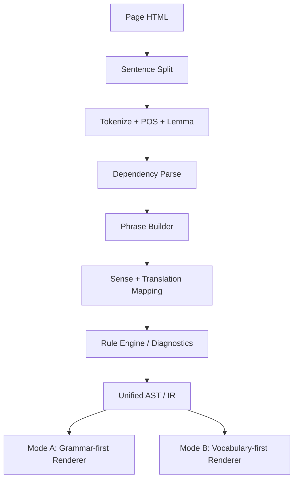
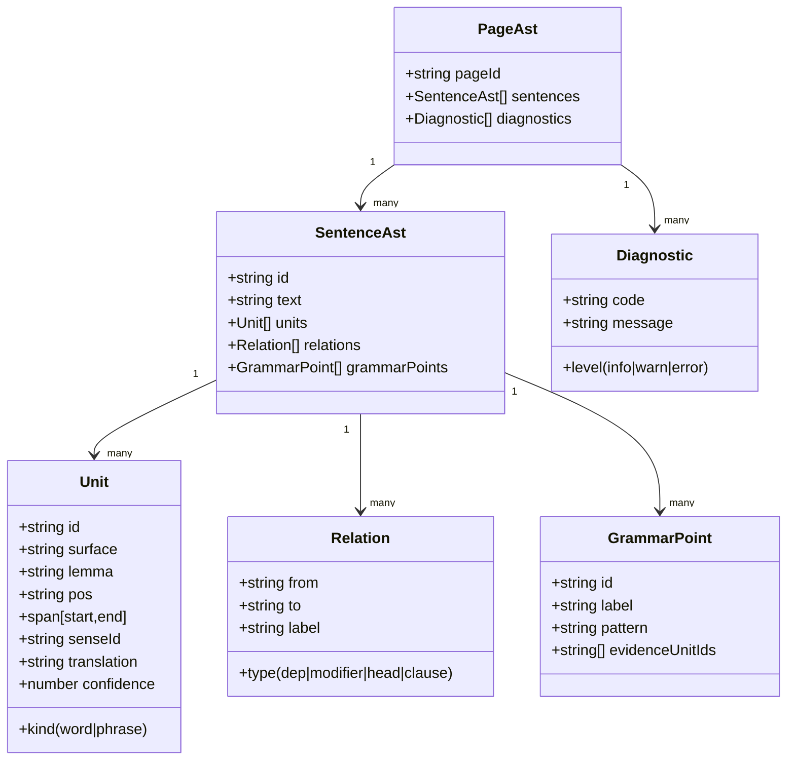
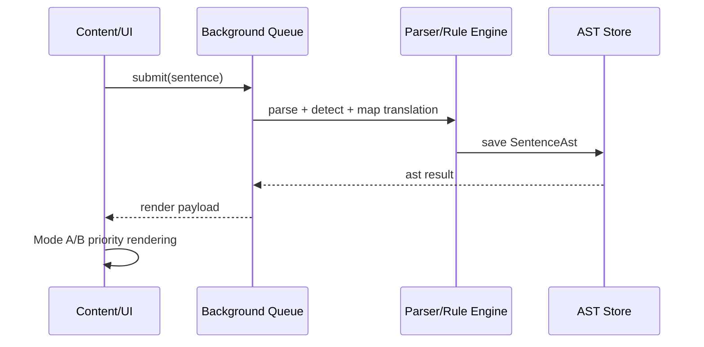

# 语法编译小白入门（面向英语页面结构化）

> 目标：你不是在“做翻译插件”，而是在做一个“英语语言服务”（像 VSCode 对代码那样）。

## 1) 一句话先懂本质

- 语法高亮：告诉你“这是什么”（词性、短语、从句）。
- 语法提示：告诉你“有没有问题”（规则诊断、歧义提醒）。
- 结构化：把一段自然语言，变成一棵可计算的结构树（AST/IR）。

你要做的是：
- 输入：页面英文段落
- 输出：统一中间层 AST（语法+词汇+语义）
- 展示：模式A（语法优先）/ 模式B（词汇优先）

## 2) 用 VSCode 类比（最容易懂）

VSCode 写代码时你看到的能力，本质分层是：

1. Lexer/Tokenizer：切成 token
2. Parser：组装语法结构（AST/CST）
3. Semantic Analyzer：做语义判断（类型/依赖/规则）
4. Language Service：把结果变成高亮、提示、补全

英语场景是一模一样的，只是对象从“编程语言”换成“自然语言”。

## 3) 你的系统最小流水线



关键点：
- `Translation Mapping` 只做一次。
- 两个模式只是“显示优先级不同”，不是两套分析系统。

## 4) 中间层 AST 长什么样

你可以先用这个“够用版”结构：

```ts
export type PageAst = {
  pageId: string;
  sentences: SentenceAst[];
  diagnostics: Diagnostic[];
};

export type SentenceAst = {
  id: string;
  text: string;
  units: Unit[];               // word/phrase
  relations: Relation[];       // dependency/grammar links
  grammarPoints: GrammarPoint[];
};

export type Unit = {
  id: string;
  kind: 'word' | 'phrase';
  surface: string;             // 原文片段
  lemma?: string;
  pos?: string;
  span: [number, number];      // 字符偏移
  senseId?: string;            // 语义义项
  translation?: string;        // 在上下文下的翻译
  confidence?: number;
};

export type Relation = {
  type: 'dep' | 'modifier' | 'head' | 'clause';
  from: string;
  to: string;
  label: string;
};

export type GrammarPoint = {
  id: string;
  label: string;               // 如 Present Perfect Continuous
  pattern: string;
  evidenceUnitIds: string[];
};

export type Diagnostic = {
  level: 'info' | 'warn' | 'error';
  code: string;
  message: string;
  sentenceId?: string;
  unitIds?: string[];
};
```

## 5) AST 关系图（你可以把它当数据库模型）



## 6) 一条句子如何跑完（时序图）



## 7) 最容易踩坑的 4 件事（白话版）

1. 对齐坑
- `take care of` 是 3 词，但中文是“照顾”1词。
- 解决：先 phrase 再 word，不要从逐词翻译起步。

2. 消歧坑
- `book` 可能是名词，也可能是动词。
- 解决：translation 绑定到上下文的 `senseId`，不要只绑定 token 文本。

3. 粒度坑
- 一会儿讲单词，一会儿讲时态，用户会乱。
- 解决：固定展示层级：词 -> 短语 -> 语法点。

4. 双模式冲突坑
- 语法模式和词汇模式不能各自判定。
- 解决：共用同一个 AST，只换渲染优先级。

## 8) 分阶段落地（可执行）

### P0：打底（1-2 周）
- 定义 AST schema 与序列化格式。
- 接入句子切分 + POS/dep 结果映射到 AST。
- 做一个最小渲染器（只高亮主谓宾+短语）。

### P1：可用（2-4 周）
- 接入短语级翻译 + 词级回填。
- 接入 grammar point 检测（时态、从句、被动）。
- 输出 Mode A/Mode B 两套视图。

### P2：好用（持续）
- 增量计算（只重跑变更句子）。
- 置信度与回退策略（低置信度交给 LLM）。
- 回归集测试（20-50 真实句）。

## 9) 技术选型建议（先求稳）

- 解析：`spaCy + en_core_web_sm`（快、成熟、可解释）
- 翻译：短语优先的翻译 API（不是纯逐词）
- 缓存：`hash(sentence) -> SentenceAst`（Dexie/SQLite 都可）
- 调度：background 队列（限流+重试+去重）
- 前端渲染：content script 只负责展示，不做重 NLP

## 10) 你现在就可以做的第一步

- 先不追求“全语法”。
- 只做 3 类结构：
  - 主谓宾
  - 介词短语
  - 常见从句（that/which/if/when）

做到这一步，你就已经从“翻译工具”升级成“语言结构引擎”了。
